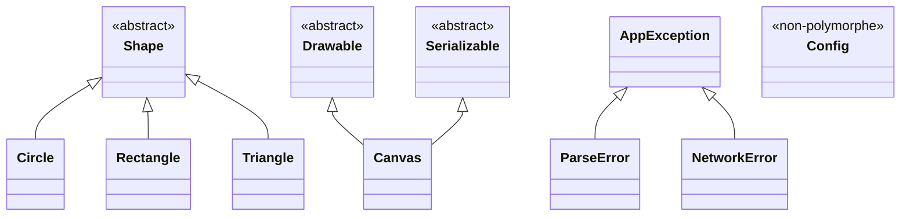

🔝 Retour au [Sommaire](/SOMMAIRE.md)

# Solution — Checkpoint Chapitre 17

# Reconstruire les classes du binaire `ch17-oop` à partir du désassemblage seul

> ⚠️ **SPOILERS** — Ce fichier contient le corrigé complet. Tentez le checkpoint avant de le consulter.

---

## Table des matières

1. [Phase A — Reconnaissance initiale](#phase-a--reconnaissance-initiale)  
2. [Phase B — Reconstruction de la hiérarchie via la RTTI](#phase-b--reconstruction-de-la-hiérarchie-via-la-rtti)  
3. [Phase C — Analyse des vtables](#phase-c--analyse-des-vtables)  
4. [Phase D — Layouts mémoire des objets](#phase-d--layouts-mémoire-des-objets)  
5. [Phase E — Prototypes des méthodes](#phase-e--prototypes-des-méthodes)  
6. [Phase F — Identification des mécanismes C++](#phase-f--identification-des-mécanismes-c)  
7. [Passe 2 — Reconstruction depuis le binaire strippé](#passe-2--reconstruction-depuis-le-binaire-strippé)

---

## Phase A — Reconnaissance initiale

### Triage du binaire (`ch17-oop_O0`)

```bash
$ file ch17-oop_O0
ch17-oop_O0: ELF 64-bit LSB executable, x86-64, version 1 (SYSV),
             dynamically linked, interpreter /lib64/ld-linux-x86-64.so.2,
             for GNU/Linux 3.2.0, with debug info, not stripped

$ checksec --file=ch17-oop_O0
    Arch:     amd64-64-little
    RELRO:    Partial RELRO
    Stack:    Canary found
    NX:       NX enabled
    PIE:      No PIE (0x400000)
    RPATH:    No RPATH
    RUNPATH:  No RUNPATH
```

Binaire ELF 64-bit, dynamiquement linké, **non strippé avec debug info** (passe 1). ASLR désactivé (pas de PIE), canary activé.

### Extraction des noms de classes

```bash
$ strings ch17-oop_O0 | grep -oP '^\d+[A-Z]\w+' | sort -u
5Shape
6Canvas
6Circle
6Config
8Drawable
8Triangle
9Rectangle
10ParseError
12AppException
12NetworkError
12Serializable
```

**11 classes identifiées** par les chaînes typeinfo name. Notons que `Config` apparaît dans les chaînes mais n'a pas forcément de vtable (à vérifier — si elle n'est pas polymorphe, elle n'aura pas de typeinfo via RTTI mais pourra apparaître via d'autres mécanismes comme les exceptions).

### Volume de symboles

```bash
$ nm ch17-oop_O0 | wc -l
1847

$ nm ch17-oop_O0 | grep ' W ' | wc -l
1203

$ nm ch17-oop_O0 | grep ' T ' | wc -l
312

$ nm -C ch17-oop_O0 | grep 'vtable for' | wc -l
12
```

65% de symboles weak (instanciations de templates). 12 vtables présentes.

---

## Phase B — Reconstruction de la hiérarchie via la RTTI

### Classification des typeinfo

```bash
$ nm -C ch17-oop_O0 | grep 'typeinfo for' | grep -v 'typeinfo name'
```

En examinant chaque structure `_ZTI` dans `.rodata`, on identifie le type par le vptr de la structure typeinfo :

| Classe | Type de typeinfo | Justification |  
|--------|-----------------|---------------|  
| `Shape` | `__class_type_info` | Racine, pas de parent polymorphe |  
| `Circle` | `__si_class_type_info` | Hérite de Shape uniquement |  
| `Rectangle` | `__si_class_type_info` | Hérite de Shape uniquement |  
| `Triangle` | `__si_class_type_info` | Hérite de Shape uniquement |  
| `Drawable` | `__class_type_info` | Racine de sa propre hiérarchie |  
| `Serializable` | `__class_type_info` | Racine de sa propre hiérarchie |  
| `Canvas` | `__vmi_class_type_info` | Hérite de Drawable ET Serializable (multiple) |  
| `AppException` | `__si_class_type_info` | Hérite de std::exception |  
| `ParseError` | `__si_class_type_info` | Hérite de AppException |  
| `NetworkError` | `__si_class_type_info` | Hérite de AppException |

`Config` n'a **pas** de typeinfo polymorphe — il n'a pas de méthode virtuelle, donc pas de vtable, pas de vptr, pas de RTTI. Il apparaît dans `strings` uniquement si son nom est utilisé dans du code (par exemple une chaîne litérale ou via un autre mécanisme). En réalité, dans notre binaire, `Config` n'est pas polymorphe.

### Liens d'héritage (pointeurs `__base_type`)

| Classe dérivée | `__base_type` pointe vers | Relation |  
|----------------|---------------------------|----------|  
| `Circle` | `_ZTI5Shape` | Circle → Shape |  
| `Rectangle` | `_ZTI5Shape` | Rectangle → Shape |  
| `Triangle` | `_ZTI5Shape` | Triangle → Shape |  
| `AppException` | `_ZTISt9exception` | AppException → std::exception |  
| `ParseError` | `_ZTI12AppException` | ParseError → AppException |  
| `NetworkError` | `_ZTI12AppException` | NetworkError → AppException |

Pour `Canvas` (`__vmi_class_type_info`), lecture du tableau `__base_info` :

| Base | `__base_type` | `__offset_flags` | Offset | Public | Virtuel |  
|------|---------------|-------------------|--------|--------|---------|  
| #0 | `_ZTI8Drawable` | `0x0000000000000002` | 0 | oui | non |  
| #1 | `_ZTI12Serializable` | `0x0000000000000802` | 8 | oui | non |

`__flags` = 0 (pas de diamant, pas de répétition).

### Diagramme de hiérarchie reconstruit

```
std::exception
    └── AppException (concrete)
            ├── ParseError (concrete)
            └── NetworkError (concrete)

Shape (abstract — area() et perimeter() sont pures)
    ├── Circle (concrete)
    ├── Rectangle (concrete)
    └── Triangle (concrete)

Drawable (abstract — draw() est pure)
                                          ╲
                                            Canvas (concrete, héritage multiple)
                                          ╱
Serializable (abstract — serialize() et deserialize() sont pures)
```

En notation Mermaid :



---

## Phase C — Analyse des vtables

### Vtable de `Shape` (classe abstraite racine)

```bash
$ nm -C ch17-oop_O0 | grep 'vtable for Shape'
```

```
vtable for Shape @ _ZTV5Shape :
  [-16] offset-to-top  = 0
  [-8]  typeinfo        → _ZTI5Shape
  [0]   slot 0 : Shape::~Shape() [D1]            — complete destructor
  [8]   slot 1 : Shape::~Shape() [D0]            — deleting destructor
  [16]  slot 2 : __cxa_pure_virtual               — area() = 0 (PURE)
  [24]  slot 3 : __cxa_pure_virtual               — perimeter() = 0 (PURE)
  [32]  slot 4 : Shape::describe() const          — implémentation par défaut
```

Les slots 2 et 3 pointent vers `__cxa_pure_virtual` → **Shape est abstraite**.

### Vtable de `Circle`

```
vtable for Circle @ _ZTV6Circle :
  [-16] offset-to-top  = 0
  [-8]  typeinfo        → _ZTI6Circle
  [0]   slot 0 : Circle::~Circle() [D1]          — override
  [8]   slot 1 : Circle::~Circle() [D0]          — override
  [16]  slot 2 : Circle::area() const             — override (remplace pure virtual)
  [24]  slot 3 : Circle::perimeter() const        — override (remplace pure virtual)
  [32]  slot 4 : Circle::describe() const         — override
```

Tous les slots sont overridés. Même structure (5 slots) que Shape.

### Vtable de `Rectangle`

```
vtable for Rectangle @ _ZTV9Rectangle :
  [-16] offset-to-top  = 0
  [-8]  typeinfo        → _ZTI9Rectangle
  [0]   slot 0 : Rectangle::~Rectangle() [D1]    — override
  [8]   slot 1 : Rectangle::~Rectangle() [D0]    — override
  [16]  slot 2 : Rectangle::area() const          — override
  [24]  slot 3 : Rectangle::perimeter() const     — override
  [32]  slot 4 : Rectangle::describe() const      — override
```

### Vtable de `Triangle`

```
vtable for Triangle @ _ZTV8Triangle :
  [-16] offset-to-top  = 0
  [-8]  typeinfo        → _ZTI8Triangle
  [0]   slot 0 : Triangle::~Triangle() [D1]      — override
  [8]   slot 1 : Triangle::~Triangle() [D0]      — override
  [16]  slot 2 : Triangle::area() const           — override
  [24]  slot 3 : Triangle::perimeter() const      — override
  [32]  slot 4 : Shape::describe() const          — HÉRITÉ (pas de surcharge)
```

Le slot 4 pointe vers `Shape::describe()`, **pas** vers une version `Triangle::`. Cela indique que `Triangle` ne surcharge pas `describe()`.

### Vtable de `Drawable` (abstraite)

```
vtable for Drawable @ _ZTV8Drawable :
  [-16] offset-to-top  = 0
  [-8]  typeinfo        → _ZTI8Drawable
  [0]   slot 0 : Drawable::~Drawable() [D1]
  [8]   slot 1 : Drawable::~Drawable() [D0]
  [16]  slot 2 : __cxa_pure_virtual               — draw() = 0 (PURE)
  [24]  slot 3 : Drawable::zOrder() const         — implémentation par défaut
```

### Vtable de `Serializable` (abstraite)

```
vtable for Serializable @ _ZTV12Serializable :
  [-16] offset-to-top  = 0
  [-8]  typeinfo        → _ZTI12Serializable
  [0]   slot 0 : Serializable::~Serializable() [D1]
  [8]   slot 1 : Serializable::~Serializable() [D0]
  [16]  slot 2 : __cxa_pure_virtual               — serialize() = 0 (PURE)
  [24]  slot 3 : __cxa_pure_virtual               — deserialize() = 0 (PURE)
```

### Vtable composite de `Canvas` (héritage multiple)

C'est la vtable la plus complexe. Elle est composée de deux parties :

```
vtable for Canvas @ _ZTV6Canvas :

  ═══ Partie 1 : interface Drawable + méthodes propres de Canvas ═══
  [-16] offset-to-top  = 0
  [-8]  typeinfo        → _ZTI6Canvas
  [0]   slot 0 : Canvas::~Canvas() [D1]
  [8]   slot 1 : Canvas::~Canvas() [D0]
  [16]  slot 2 : Canvas::draw() const             — override de Drawable::draw
  [24]  slot 3 : Canvas::zOrder() const           — override de Drawable::zOrder
  [32]  slot 4 : Canvas::serialize() const        — implémente Serializable::serialize
  [40]  slot 5 : Canvas::deserialize(std::string const&) — implémente Serializable::deserialize

  ═══ Partie 2 : interface Serializable (sous-objet secondaire) ═══
  [48]  offset-to-top  = -8
  [56]  typeinfo        → _ZTI6Canvas                (même typeinfo)
  [64]  slot 0 : thunk → Canvas::~Canvas() [D1]      — ajustement this -8
  [72]  slot 1 : thunk → Canvas::~Canvas() [D0]      — ajustement this -8
  [80]  slot 2 : thunk → Canvas::serialize() const    — ajustement this -8
  [88]  slot 3 : thunk → Canvas::deserialize(...)     — ajustement this -8
```

L'offset-to-top de la partie 2 est **-8**, confirmant que le sous-objet `Serializable` est à l'offset 8 dans `Canvas`.

Les thunks se vérifient en désassemblant :

```bash
$ objdump -d -C -M intel ch17-oop_O0 | grep -A3 'thunk to Canvas'
```

Chaque thunk fait `sub rdi, 8; jmp <vraie méthode>`.

### Vtables des exceptions

```
vtable for AppException :
  [0]  slot 0 : AppException::~AppException() [D1]
  [8]  slot 1 : AppException::~AppException() [D0]
  [16] slot 2 : AppException::what() const        — override de std::exception::what()

vtable for ParseError :
  [0]  slot 0 : ParseError::~ParseError() [D1]
  [8]  slot 1 : ParseError::~ParseError() [D0]
  [16] slot 2 : AppException::what() const        — HÉRITÉ (pas de surcharge)

vtable for NetworkError :
  [0]  slot 0 : NetworkError::~NetworkError() [D1]
  [8]  slot 1 : NetworkError::~NetworkError() [D0]
  [16] slot 2 : AppException::what() const        — HÉRITÉ (pas de surcharge)
```

`ParseError` et `NetworkError` ne surchargent pas `what()` — ils utilisent l'implémentation de `AppException`.

---

## Phase D — Layouts mémoire des objets

Les layouts sont reconstruits en analysant les constructeurs (qui initialisent chaque champ) et les méthodes (qui accèdent aux champs via `this`).

### `Shape` (abstract, non instanciable directement)

```
Shape (sizeof = 56, déduit des classes dérivées) :
  offset 0   : vptr (8 bytes)            → vtable for Shape
  offset 8   : name_ (std::string)       — 32 bytes (nouvelle ABI __cxx11)
  offset 40  : x_ (double)               — 8 bytes
  offset 48  : y_ (double)               — 8 bytes
```

Justification : le constructeur `Shape::Shape(const string&, double, double)` écrit :
- `[rdi+0]` ← vptr (adresse vtable Shape)  
- Appel au constructeur de copie de `std::string` à `[rdi+8]` (on voit le `lea rdi, [this+8]` puis `call basic_string(const basic_string&)`)  
- `[rdi+40]` ← premier `double` (xmm0 → movsd)  
- `[rdi+48]` ← deuxième `double` (xmm1 → movsd)

Le pattern `lea rax, [rdi+24]; mov [rdi+8], rax` dans le constructeur de `std::string` confirme le SSO (offset 8 + 16 = 24, cf. section 17.5).

### `Circle`

```
Circle (sizeof = 64) :
  offset 0   : vptr (8 bytes)            → vtable for Circle
  offset 8   : name_ (std::string)       — 32 bytes [hérité de Shape]
  offset 40  : x_ (double)               — 8 bytes  [hérité de Shape]
  offset 48  : y_ (double)               — 8 bytes  [hérité de Shape]
  offset 56  : radius_ (double)          — 8 bytes  [propre à Circle]
```

Justification : le constructeur `Circle::Circle(double, double, double)` :
1. Appelle `Shape::Shape("Circle", x, y)` avec le même `rdi`.  
2. Écrase le vptr : `mov QWORD [rdi], &_ZTV6Circle+16`.  
3. Écrit `radius_` : `movsd [rdi+56], xmm2`.

La méthode `Circle::area() const` lit `[rdi+56]` (radius_), le multiplie par lui-même et par π. La méthode `Circle::perimeter() const` lit `[rdi+56]` et multiplie par 2π. Cohérent.

### `Rectangle`

```
Rectangle (sizeof = 72) :
  offset 0   : vptr (8 bytes)            → vtable for Rectangle
  offset 8   : name_ (std::string)       — 32 bytes [hérité de Shape]
  offset 40  : x_ (double)               — 8 bytes  [hérité de Shape]
  offset 48  : y_ (double)               — 8 bytes  [hérité de Shape]
  offset 56  : width_ (double)           — 8 bytes  [propre]
  offset 64  : height_ (double)          — 8 bytes  [propre]
```

Justification : `Rectangle::area()` lit `[rdi+56]` et `[rdi+64]`, les multiplie (`mulsd`). `Rectangle::perimeter()` additionne `[rdi+56]` et `[rdi+64]` puis multiplie par 2.

### `Triangle`

```
Triangle (sizeof = 80) :
  offset 0   : vptr (8 bytes)            → vtable for Triangle
  offset 8   : name_ (std::string)       — 32 bytes [hérité de Shape]
  offset 40  : x_ (double)               — 8 bytes  [hérité de Shape]
  offset 48  : y_ (double)               — 8 bytes  [hérité de Shape]
  offset 56  : a_ (double)               — 8 bytes  [propre]
  offset 64  : b_ (double)               — 8 bytes  [propre]
  offset 72  : c_ (double)               — 8 bytes  [propre]
```

Justification : `Triangle::area()` lit les trois doubles à `[rdi+56]`, `[rdi+64]`, `[rdi+72]`, calcule le demi-périmètre `s = (a+b+c)/2`, puis applique la formule de Héron `sqrt(s*(s-a)*(s-b)*(s-c))`. Le pattern `addsd` × 2 → `divsd` par 2 → séquence de `subsd` et `mulsd` → `call sqrt` est reconnaissable.

### `Canvas` (héritage multiple)

```
Canvas (sizeof dépend de l'implémentation, estimé ~80+ bytes) :
  offset 0   : vptr_1 (8 bytes)          → vtable for Canvas (partie 1, Drawable)
  offset 8   : vptr_2 (8 bytes)          → vtable for Canvas (partie 2, Serializable)
  offset 16  : title_ (std::string)      — 32 bytes
  offset 48  : shapes_ (std::vector<std::shared_ptr<Shape>>) — 24 bytes
  offset 72  : z_order_ (int)            — 4 bytes
  (+ padding à 80 pour alignement)
```

Justification :
- Le constructeur écrit **deux vptr** : `mov [rdi+0], &vtable_part1` et `mov [rdi+8], &vtable_part2`. C'est la signature de l'héritage multiple (section 17.2).  
- Le constructeur de `std::string` est appelé avec `lea rdi, [this+16]` (title_).  
- Un vector est initialisé à `[this+48]` (trois pointeurs nuls ou un appel au constructeur par défaut du vector).  
- Un entier est écrit à `[this+72]` : `mov DWORD [rdi+72], esi` (z_order_).

La méthode `Canvas::addShape(shared_ptr<Shape>)` fait un `push_back` sur le vector à l'offset 48, confirmé par le pattern `cmp [rdi+56], [rdi+64]` (finish vs end_of_storage, c'est-à-dire [48+8] et [48+16]).

### `AppException`

```
AppException (sizeof = 48, estimation) :
  offset 0   : vptr (8 bytes)            → vtable for AppException
  offset 8   : msg_ (std::string)        — 32 bytes
  offset 40  : code_ (int)               — 4 bytes
  (+ padding à 48)
```

Justification : `AppException::what() const` fait `lea rdi, [this+8]; call basic_string::c_str()` → `msg_` est à l'offset 8. `AppException::code() const` fait `mov eax, [rdi+40]` → `code_` est à l'offset 40.

### `ParseError`

```
ParseError (sizeof = 56, estimation) :
  offset 0   : vptr (8 bytes)            → vtable for ParseError
  offset 8   : msg_ (std::string)        — 32 bytes [hérité AppException]
  offset 40  : code_ (int)               — 4 bytes  [hérité AppException]
  offset 44  : line_ (int)               — 4 bytes  [propre]
  (+ padding à 48 ou 56)
```

Justification : `ParseError::line() const` fait `mov eax, [rdi+44]`.

### `NetworkError`

```
NetworkError (sizeof = 80, estimation) :
  offset 0   : vptr (8 bytes)            → vtable for NetworkError
  offset 8   : msg_ (std::string)        — 32 bytes [hérité AppException]
  offset 40  : code_ (int)               — 4 bytes  [hérité AppException]
  offset 44  : (padding 4 bytes)         — alignement pour le string suivant
  offset 48  : host_ (std::string)       — 32 bytes [propre]
```

Justification : `NetworkError::host() const` fait `lea rax, [rdi+48]` → retourne un pointeur vers un `std::string` à l'offset 48.

### `Config` (non polymorphe)

```
Config (sizeof = 44 ou 48) :
  offset 0   : name (std::string)        — 32 bytes
  offset 32  : maxShapes (int)           — 4 bytes
  offset 36  : verbose (bool)            — 1 byte
  (+ padding)
```

**Pas de vptr** — `Config` n'est pas polymorphe. Le constructeur initialise directement les champs sans écrire de pointeur de vtable à l'offset 0.

---

## Phase E — Prototypes des méthodes

### Classe `Shape`

| Méthode | Virtuelle | Prototype reconstruit |  
|---------|-----------|----------------------|  
| Constructeur | non | `Shape(const std::string& name, double x, double y)` |  
| Destructeur | oui | `virtual ~Shape() = default` |  
| `area` | oui (pure) | `virtual double area() const = 0` |  
| `perimeter` | oui (pure) | `virtual double perimeter() const = 0` |  
| `describe` | oui | `virtual std::string describe() const` |  
| `name` | non | `const std::string& name() const` |  
| `move` | non | `void move(double dx, double dy)` |

Justification pour `move` : une méthode non-virtuelle (pas dans la vtable) qui fait `addsd [rdi+40], xmm0; addsd [rdi+48], xmm1` — ajoute deux doubles aux coordonnées.

### Classe `Circle`

| Méthode | Virtuelle | Prototype reconstruit |  
|---------|-----------|----------------------|  
| Constructeur | non | `Circle(double x, double y, double r)` |  
| Destructeur | oui | `virtual ~Circle()` |  
| `area` | oui (override) | `double area() const override` — `π * r²` |  
| `perimeter` | oui (override) | `double perimeter() const override` — `2πr` |  
| `describe` | oui (override) | `std::string describe() const override` |  
| `radius` | non | `double radius() const` — retourne `[this+56]` |

Le constructeur contient une vérification : `ucomisd xmm2, zero; ja .ok` suivi d'un `__cxa_allocate_exception` → lance une exception si `r <= 0`.

### Classe `Canvas`

| Méthode | Virtuelle | Via interface | Prototype reconstruit |  
|---------|-----------|---------------|----------------------|  
| Constructeur | non | — | `Canvas(const std::string& title, int z)` |  
| Destructeur | oui | Drawable+Serializable | `virtual ~Canvas()` |  
| `draw` | oui | Drawable | `void draw() const override` |  
| `zOrder` | oui | Drawable | `int zOrder() const override` |  
| `serialize` | oui | Serializable | `std::string serialize() const override` |  
| `deserialize` | oui | Serializable | `bool deserialize(const std::string& data) override` |  
| `addShape` | non | — | `void addShape(std::shared_ptr<Shape> shape)` |  
| `totalArea` | non | — | `double totalArea() const` |  
| `title` | non | — | `const std::string& title() const` |  
| `shapeCount` | non | — | `size_t shapeCount() const` |

`deserialize` lance une `ParseError` si le header ne correspond pas — identifié par `__cxa_allocate_exception` + `_ZTI10ParseError` dans le `__cxa_throw`.

---

## Phase F — Identification des mécanismes C++

### 1. Name mangling

Exemples de symboles démanglés révélateurs :

```
_ZN6CircleC1Eddd                     → Circle::Circle(double, double, double)
_ZNK5Shape8describeEv                → Shape::describe() const
_ZN8RegistryINSt7__cxx1112basic_stringI...EESt10shared_ptrI5ShapeEE3addE...
    → Registry<std::string, std::shared_ptr<Shape>>::add(...)
```

Le `__cxx11` dans les symboles confirme la nouvelle ABI (GCC ≥ 5).

### 2. Vtables et dispatch virtuel

Pattern identifié dans `main()` lors de l'itération polymorphe sur les shapes :

```nasm
mov    rax, QWORD PTR [rbx]          ; charger Shape* depuis shared_ptr  
mov    rcx, QWORD PTR [rax]          ; charger vptr  
mov    rdi, rax                       ; this = Shape*  
call   QWORD PTR [rcx+0x10]         ; vtable slot 2 → area()  
```

Appel virtuel classique `[vptr+0x10]` = slot 2 = `area()`.

### 3. RTTI

Structures typeinfo exploitées pour reconstruire toute la hiérarchie (Phase B). La `__vmi_class_type_info` de Canvas a révélé les deux bases et leurs offsets.

`dynamic_cast` identifié dans `demonstrateRTTI()` :

```nasm
lea    rsi, [rip+_ZTI5Shape]          ; source type = Shape  
lea    rdx, [rip+_ZTI6Circle]         ; target type = Circle  
mov    ecx, 0  
call   __dynamic_cast@plt  
test   rax, rax  
je     .L_not_circle  
```

`typeid` identifié via `mov rax, [vptr-8]` (accès au typeinfo pointer dans la vtable).

### 4. Exceptions

Blocs `try`/`catch` identifiés dans `main()` :

```nasm
; throw AppException("Invalid radius", 10) dans Circle::Circle :
mov    edi, 48                         ; sizeof(AppException)  
call   __cxa_allocate_exception@plt  
; ... construction ...
lea    rsi, [rip+_ZTI12AppException]   ; type lancé  
call   __cxa_throw@plt  
```

Chaîne de `catch` dans `main()` avec 4 handlers (identifiés par 4 `__cxa_begin_catch` successifs dans les landing pads) :

1. `catch (const ParseError&)` — identifié par le type dans l'action table → `_ZTI10ParseError`  
2. `catch (const NetworkError&)` — `_ZTI12NetworkError`  
3. `catch (const AppException&)` — `_ZTI12AppException`  
4. `catch (const std::exception&)` — `_ZTISt9exception`

Ordre spécifique du plus dérivé au plus général (sinon le premier catch intercepterait tout).

Cleanup landing pads identifiés dans plusieurs fonctions : sauvegarde de `rax`, appels aux destructeurs de `std::string` (pattern SSO `lea rdx, [rdi+16]; cmp [rdi], rdx`), puis `call _Unwind_Resume@plt`.

### 5. Templates

Deux instanciations de `Registry<K, V>` identifiées :

| Instanciation | Clé | Valeur | Identifié par |  
|---------------|-----|--------|---------------|  
| `Registry<std::string, std::shared_ptr<Shape>>` | `std::string` (32 bytes) | `std::shared_ptr<Shape>` (16 bytes) | Symboles + accès mémoire |  
| `Registry<int, std::string>` | `int` (4 bytes) | `std::string` (32 bytes) | Symboles + `cmp` simple sur les clés |

Les deux instanciations ont la même structure logique (vérification d'existence → insertion dans `std::map`) mais des tailles d'accès et des fonctions de comparaison différentes.

Instanciations STL majeures identifiées :
- `std::vector<std::shared_ptr<Shape>>` — facteur `sar rax, 4` (éléments de 16 bytes)  
- `std::map<std::string, std::shared_ptr<Shape>>` — navigation arborescente, nœuds avec données à offset 32  
- `std::map<int, std::string>` — comparaison de clés par `cmp` direct  
- `std::unordered_map<std::string, int>` — hachage + parcours de liste chaînée

### 6. Lambdas

Lambdas identifiées dans `demonstrateLambdas()` :

| Lambda | Signature dans les symboles | Captures | sizeof closure |  
|--------|-----------------------------|----------|----------------|  
| `printSeparator` | `{lambda()#1}` | Aucune | 1 (vide) |  
| `isLargeShape` | `{lambda(shared_ptr<Shape> const&)#2}` | `minArea` par valeur (double) | 8 |  
| `accumulate` | `{lambda(shared_ptr<Shape> const&)#3}` | `&totalArea`, `&count` par référence | 16 (2 ptrs) |  
| `describeAndCollect` | `{lambda(shared_ptr<Shape> const&)#4}` | `prefix` par valeur (string), `&descriptions` par ref | 40 (32+8) |  
| `formatShape` | `{lambda(auto const&)#5}` | `prefix` par valeur, `minArea` par valeur | 40 (32+8) |

Capture par valeur identifiée par : appel au constructeur de copie de `std::string` lors de l'initialisation de la closure et accès direct `[rdi+offset]` dans l'`operator()`.

Capture par référence identifiée par : `lea` + `mov` (stockage d'adresse) et double indirection `mov rax, [rdi+offset]; op [rax]` dans l'`operator()`.

`formatShape` est une lambda **générique** (C++14 `auto`) — visible par l'instanciation `{lambda(auto:1 const&)#5}::operator()<std::shared_ptr<Shape>>`.

### 7. Smart pointers

**`std::shared_ptr`** omniprésent :

```nasm
; Copie de shared_ptr dans demonstrateSmartPointers()
lock xadd DWORD PTR [rax+8], ecx     ; incrémente _M_use_count
```

```nasm
; Destructeur de shared_ptr (inliné dans les cleanups)
lock xadd DWORD PTR [rax+8], ecx     ; décrémente _M_use_count  
cmp    ecx, 1  
jne    .L_still_alive  
; ... appel virtuel _M_dispose via vtable du control block ...
```

`weak_ptr::lock()` identifié par la boucle `lock cmpxchg` sur l'offset 8 du control block.

`use_count()` identifié par la lecture simple `mov eax, [reg+8]` suivie d'une conversion et d'un affichage.

**`std::unique_ptr`** identifié dans `demonstrateSmartPointers()` :

```nasm
; make_unique<Config>(...)
mov    edi, 48                         ; sizeof(Config)  
call   operator new(unsigned long)@plt  
; ... construction ...
mov    QWORD PTR [rbp-0x20], rax      ; stocker le pointeur brut
```

Move de `unique_ptr` identifié par :

```nasm
mov    rax, [rbp-0x20]                ; source  
mov    [rbp-0x28], rax                ; destination  
mov    QWORD PTR [rbp-0x20], 0        ; null source  
```

`make_unique<char[]>(256)` identifié par l'appel à `operator new[](256)`.

### 8. Conteneurs STL identifiés

| Conteneur | Localisation | Type éléments | Méthode d'identification |  
|-----------|-------------|---------------|--------------------------|  
| `std::vector<shared_ptr<Shape>>` | `Canvas::shapes_`, `allShapes` dans main | `shared_ptr<Shape>` (16 bytes) | `sar rax, 4` dans size(), `push_back` avec `lock xadd` |  
| `std::map<string, shared_ptr<Shape>>` | `Registry` instanciation 1 | paire (string, shared_ptr) | Navigation `[rax+16]`/`[rax+24]`, données à `[noeud+32]` |  
| `std::map<int, string>` | `Registry` instanciation 2 | paire (int, string) | Même pattern arborescente, `cmp` direct sur entier |  
| `std::unordered_map<string, int>` | `demonstrateRTTI()` | paire (string, int) | Hash + `div` + liste chaînée |  
| `std::vector<std::string>` | `descriptions` dans lambdas | `std::string` (32 bytes) | `sar rax, 5` dans size() |  
| `std::string` | Partout | — | Pattern SSO `lea [rdi+16]; cmp [rdi], rdx` |

---

## Passe 2 — Reconstruction depuis le binaire strippé

### Différences de méthodologie sur `ch17-oop_O2_strip`

**Symboles disponibles :** seuls les symboles dynamiques (`nm -D`) subsistent. Cela inclut les fonctions de `libstdc++` appelées via la PLT (`__cxa_throw`, `__dynamic_cast`, `_Unwind_Resume`, `operator new`, etc.) mais pas les fonctions applicatives.

```bash
$ nm ch17-oop_O2_strip 2>/dev/null | wc -l
0

$ nm -D ch17-oop_O2_strip | wc -l
287
```

**RTTI toujours présente :** les chaînes typeinfo et les structures `_ZTI` sont toujours dans `.rodata` et permettent de reconstruire la hiérarchie exactement comme en passe 1.

```bash
$ strings ch17-oop_O2_strip | grep -oP '^\d+[A-Z]\w+' | sort -u
# Même résultat que la passe 1
```

**Vtables toujours présentes :** les vtables sont dans `.rodata` et accessibles. Mais les adresses des fonctions dans les slots pointent vers du code sans nom. Il faut analyser le code pour identifier chaque méthode.

### Effets des optimisations observés

**Dévirtualisation :** dans `main()`, certains appels qui étaient des dispatch virtuels (`call [rax+offset]`) en `-O0` sont devenus des `call` directs en `-O2`. Par exemple, quand un `Circle` est construit localement et que son type est connu, GCC appelle `Circle::area()` directement sans passer par la vtable.

**Inlining :** les petites méthodes comme `Circle::radius() const` (un simple `mov` + `ret`) ont été inlinées dans les sites d'appel. La fonction n'existe plus comme entité distincte dans `.text`.

**Inlining des destructeurs de `std::string` :** le pattern SSO (`lea rdx, [rdi+16]; cmp [rdi], rdx; je .skip; call operator delete`) apparaît directement dans le code des destructeurs de classe au lieu d'être un appel séparé à `~basic_string`.

**Fusion des constructeurs C1/C2 :** en `-O2`, GCC fusionne souvent les constructeurs C1 et C2 en un seul corps de code (ils étaient déjà identiques en `-O0`, mais maintenant un seul symbole subsiste).

**Templates inlinés :** certaines méthodes de `Registry` (comme `contains` et `size`) ont été inlinées dans les fonctions appelantes. Elles n'apparaissent plus comme fonctions distinctes.

### Procédure de reconstruction sans symboles

1. **Extraire les classes via `strings`** → résultat identique à la passe 1.  
2. **Localiser les structures typeinfo** dans Ghidra : Window → Defined Strings → filtrer par les chaînes `_ZTS`, puis Find References pour chaque chaîne.  
3. **Remonter aux vtables** : chaque typeinfo est référencée par la vtable (champ à l'offset -8). Trouver les XREF vers les typeinfo donne les vtables.  
4. **Analyser les slots des vtables** : chaque slot pointe vers une fonction sans nom. Analyser le code de chaque fonction pour déterminer son rôle (destructeur → appelle d'autres destructeurs et peut appeler `operator delete`, area → calcul mathématique, etc.).  
5. **Identifier les constructeurs** : chercher les fonctions qui écrivent des adresses de vtable à `[rdi+0]`. Les XREF vers les vtables depuis `.text` identifient les constructeurs.  
6. **Reconstruire les layouts** : à partir des constructeurs et des méthodes identifiées, noter les offsets accédés.

### Résultat final passe 2

La hiérarchie reconstruite est **identique** à celle de la passe 1 — la RTTI ne change pas entre `-O0` et `-O2`. Les vtables ont le même nombre de slots et les mêmes relations.

Les layouts mémoire sont identiques (les offsets des membres ne changent pas avec le niveau d'optimisation, seulement la manière dont le code y accède).

La différence principale est le **degré de confiance** dans l'identification des méthodes. En passe 1, le nom de chaque méthode est donné par les symboles. En passe 2, les noms sont déduits de l'analyse du code : « la fonction au slot 2 de la vtable de Circle calcule π×r², c'est `area()` ». Le résultat fonctionnel est le même, mais le chemin pour y arriver est plus long et repose sur la compréhension de la logique du code.

---


⏭️
